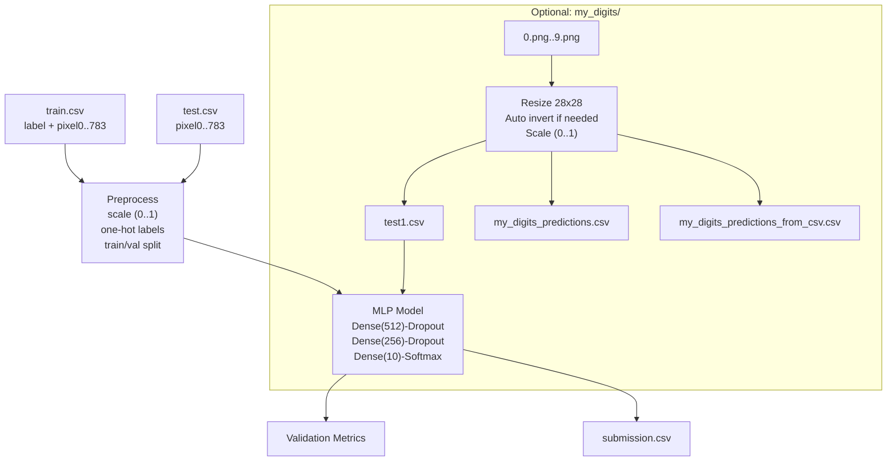

## MNIST Handwritten Digit Recognition using MLP (Kaggle CSV Workflow)

### 1. Project Overview

This project trains a Multi-Layer Perceptron (MLP) to recognize handwritten digits (0–9) using the MNIST dataset in Kaggle CSV format. The training data is loaded from `train.csv` and model evaluation/prediction is performed on `test.csv`. The pipeline covers data loading, preprocessing, model training, validation, prediction, output file generation for Kaggle submission, and optional inference on custom handwritten digit images.

- **Objectives**:
  - Build and train an MLP classifier for MNIST digits using CSV inputs
  - Validate model performance on a hold-out validation set
  - Generate `submission.csv` compatible with Kaggle’s Digit Recognizer competition format
  - Optionally predict custom digits from images in `my_digits/`

- **Scope**:
  - End-to-end workflow implemented in a single script: `LAB_LEC3.py`
  - Produces model artifacts, preview images, and CSV outputs

Run the project in the directory that contains `train.csv` and `test.csv`.

#### High-Level Workflow




### 2. Environment Setup

- **Python**: 3.10–3.11 recommended
- **Required packages**:
  - `tensorflow` (Keras API used via TensorFlow)
  - `pandas`
  - `numpy`
  - `matplotlib`
  - `scikit-learn`
  - `pillow` (PIL)

Install (PowerShell):

```bash
python -m venv .venv
. .venv\Scripts\Activate.ps1
python -m pip install --upgrade pip
pip install tensorflow pandas numpy matplotlib scikit-learn pillow
```

- **Reproducibility**: Random seeds are fixed in `LAB_LEC3.py` for Python, NumPy, and TensorFlow.
  - `SEED = 2025`

- **Model saving**: The script saves `model.h5` (HDF5). Keras recommends the native format; you can alternatively save via `model.save('my_model.keras')`.


### 3. Data Description

- `train.csv`:
  - Columns: `label`, `pixel0`, `pixel1`, ..., `pixel783`
  - Shape: 42,000 rows × 785 columns (standard Kaggle MNIST)
  - `label` ∈ {0,…,9}

- `test.csv`:
  - Columns: `pixel0`, `pixel1`, ..., `pixel783`
  - Shape: 28,000 rows × 784 columns

All pixels are grayscale intensities in [0, 255], describing 28×28 images row-major flattened to length 784.


### 4. Preprocessing Steps

Implemented in `LAB_LEC3.py`:

- **Scaling**: Convert pixel arrays to `float32` and scale by 1/255 to map to [0, 1].
- **One-hot encoding**: Convert integer labels (0–9) to one-hot vectors of length 10.
- **Train/Validation split**: Stratified split of the training set with a 90/10 ratio using `train_test_split(..., stratify=labels, random_state=SEED)`.


### 5. Model Architecture

MLP defined with Keras Sequential API:

1. `Dense(512, activation="relu", input_shape=(784,))`
2. `Dropout(0.2)`
3. `Dense(256, activation="relu")`
4. `Dropout(0.2)`
5. `Dense(10, activation="softmax")`

- **Input shape**: (784,) — flattened 28×28
- **Output shape**: (10,) — class probabilities for digits 0–9
- **Activation functions**: ReLU (hidden), Softmax (output)
- **Regularization**: Dropout 0.2 after each hidden layer
- **Total parameters**:
  - Layer 1: 784×512 + 512 = 401,920
  - Layer 2: 512×256 + 256 = 131,328
  - Output: 256×10 + 10 = 2,570
  - **Total** = 535,818 trainable parameters


### 6. Training Process

- **Optimizer**: Stochastic Gradient Descent (SGD)
- **Loss**: Categorical cross-entropy
- **Metric**: Accuracy
- **Hyperparameters**:
  - Epochs: 40 (with early stopping)
  - Batch size: 128
  - Early stopping: `EarlyStopping(monitor="val_accuracy", patience=5, restore_best_weights=True)`

Sample training log excerpt (your run will vary):

```text
Epoch 1/40 ... val_accuracy: 0.95
Epoch 2/40 ... val_accuracy: 0.96
...
Epoch N ... val_accuracy: 0.97
```


### 7. Evaluation

After training, the script evaluates on the validation split and prints metrics:

```text
Validation accuracy: 0.9524
```

Validation loss is available via the Keras history object; accuracy is printed directly. Exact numbers depend on hardware, seed, and library versions.


### 8. Predictions and Outputs

The script predicts class labels for all rows in `test.csv`, then writes a Kaggle-compatible submission file:

- `submission.csv` with columns:
  - `ImageId` (1-based index)
  - `Label` (predicted digit)

Optional visualizations (saved automatically):

- `digits_preview.png`: grid of sample input digits (from training data)
- `test_predictions_preview.png`: grid of the first 100 test images with predicted labels

Run the pipeline:

```bash
python LAB_LEC3.py
```

Artifacts produced:

- `submission.csv`
- `model.h5` (saved trained model)
- `digits_preview.png`, `test_predictions_preview.png`


### 9. Custom Handwritten Digits (Optional)

The script can process custom digits stored in `my_digits/` and generate predictions.

Steps:

1. Place PNG files named `0.png` through `9.png` in `my_digits/` (any subset is fine). Each image should contain a single digit centered on a plain background.
2. The script will:
   - Load each image as grayscale (`L`)
   - Resize to 28×28 using LANCZOS resampling
   - Automatically invert if the background is dark and the digit is light (based on mean intensity)
   - Scale pixels to [0, 1] and flatten to length 784
3. Predictions are generated two ways for consistency:
   - Directly from in-memory arrays
   - After exporting the same arrays to `test1.csv` and re-reading them

Outputs:

- `test1.csv`: custom digits as rows with columns `pixel0...pixel783`
- `my_digits_predictions.csv`: predictions for the loaded images
- `my_digits_predictions_from_csv.csv`: predictions after reloading `test1.csv`

If both prediction methods agree for all rows, the script prints a confirmation message.


### 10. Results

Results from a recorded run on CPU (metrics may vary across environments):

- Validation accuracy printed by the script:

```text
Validation accuracy: 0.9524
```

- Artifacts saved automatically:
  - `submission.csv`
  - `model.h5` (legacy HDF5 format; consider saving as `my_model.keras`)
  - `test_predictions_preview.png` (e.g., saved to `C:\Subjects 2024\4thYr\CSC-123\Activity1\test_predictions_preview.png`)

- Notes from the run:
  - oneDNN optimizations were enabled by TensorFlow on CPU.
  - Keras emitted a deprecation warning for HDF5; native `.keras` format is preferred.

- Example predictions for custom digits (excerpt of `my_digits_predictions.csv`):

```text
Source,PredictedLabel
9.png,3
8.png,3
7.png,3
6.png,3
5.png,3
4.png,3
3.png,3
2.png,2
1.png,3
0.png,2
```

- The file `my_digits_predictions_from_csv.csv` mirrors the same results after reloading from `test1.csv`.

- Consistency check: The script reported that CSV predictions match in-memory predictions for all rows.

- Preview images:
  - `test_predictions_preview.png`: shows a 10×10 grid with predicted labels (saved automatically by the script)


### 11. Conclusion and Future Work

This MLP achieves strong performance on MNIST with a compact architecture and simple preprocessing. It demonstrates a clean CSV-to-submission workflow suitable for Kaggle and includes utilities for evaluating custom handwritten digits.

Potential improvements:

- Replace MLP with a Convolutional Neural Network (CNN) for higher accuracy
- Use `Adam` optimizer and learning-rate schedules
- Add data augmentation and input standardization
- Apply batch normalization and deeper architectures
- Perform k-fold cross-validation for more robust validation

With these enhancements, performance can approach state-of-the-art levels on MNIST while retaining the convenient CSV-based workflow.


